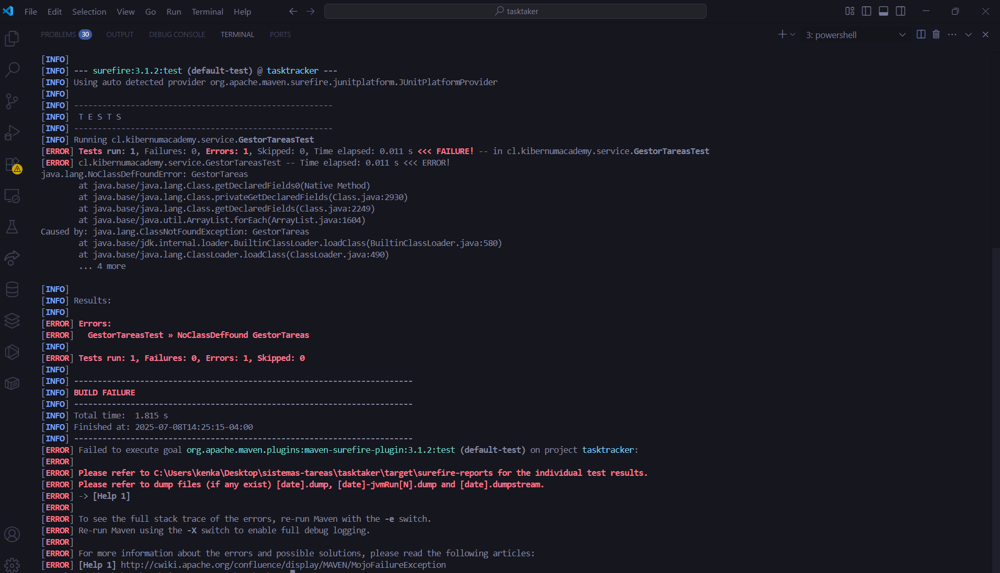
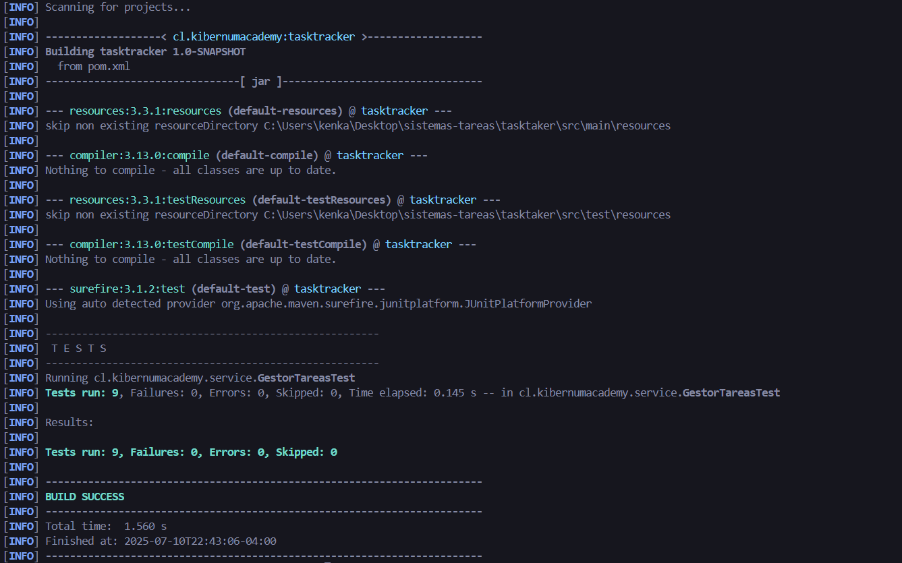
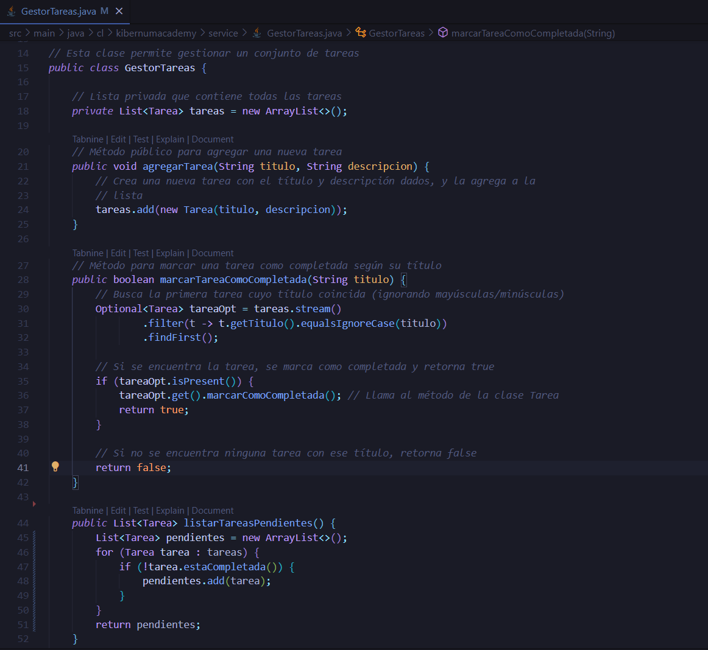
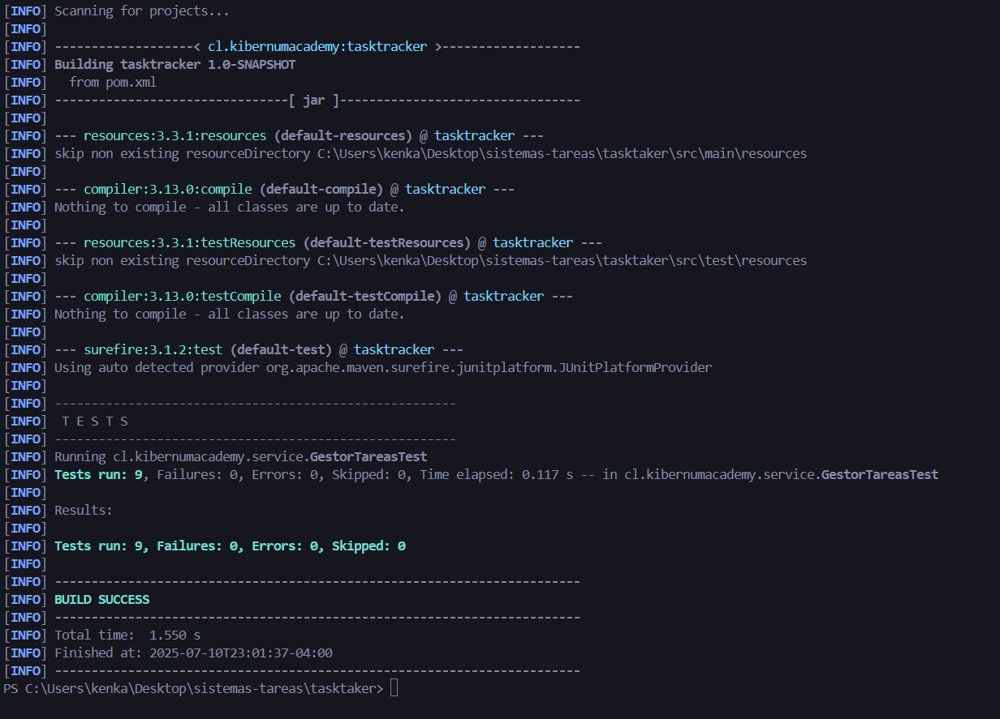

# 🧪 Gestor de Tareas con TDD

Este proyecto es un sistema de gestión de tareas construido usando el enfoque **TDD (Test Driven Development)**. Incluye funcionalidades básicas para manejar tareas: agregarlas, marcarlas como completadas y listarlas, todo respaldado por pruebas automatizadas.

---
👨‍💻 Autor
Módulo 3 -  Actividad 4
Proyecto: Sistema TaskTracker con JUnit
Equipo 4:  
- Fabiola Díaz,
- Felipe Lobos,
- Eduardo Arellano, 
- Carlos Vásquez


## 🔁 Ciclo TDD: Red - Green - Refactor

TDD se basa en tres pasos fundamentales:

### 🔴 Red: Escribir una prueba que falla



### ✅ Green: Hacer que la prueba pase



### ✅ Green: Código Zona Verde



### ♻️ Refactor: Mejorar el código sin romper las pruebas



### ♻️ Refactor Código:

  

---

## 🚀 Funcionalidades principales

- Crear tareas con título y descripción
- Marcar tareas como completadas
- Listar solo tareas pendientes
- Limpiar todas las tareas
- Pruebas unitarias con JUnit 5
- Uso de `@BeforeEach`, `@AfterEach`, `@ParameterizedTest`, `assumeTrue` y `assumingThat`

---

## 🧪 Tecnologías utilizadas

- Java 11 o superior
- JUnit 5
- Hamcrest
- Maven

---

## ▶️ Cómo ejecutar

1. Clona el repositorio:

```bash
git clone https://github.com/tuusuario/gestor-tareas-tdd.git
cd gestor-tareas-tdd

